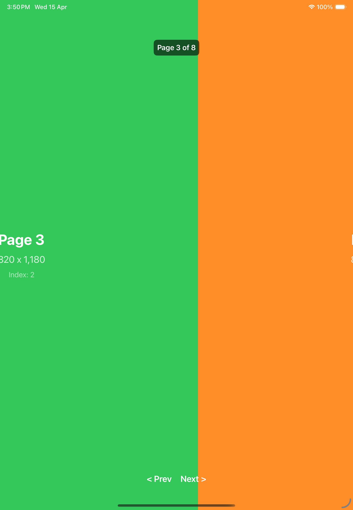
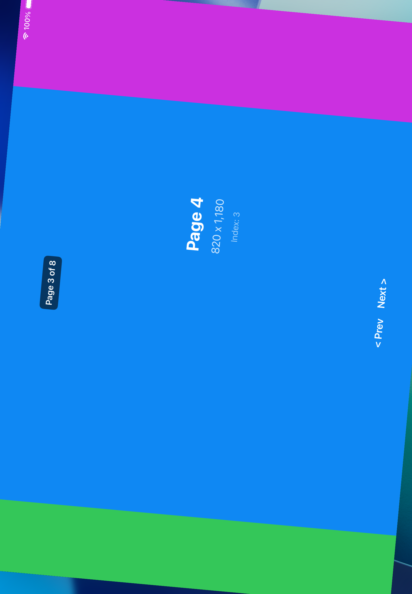
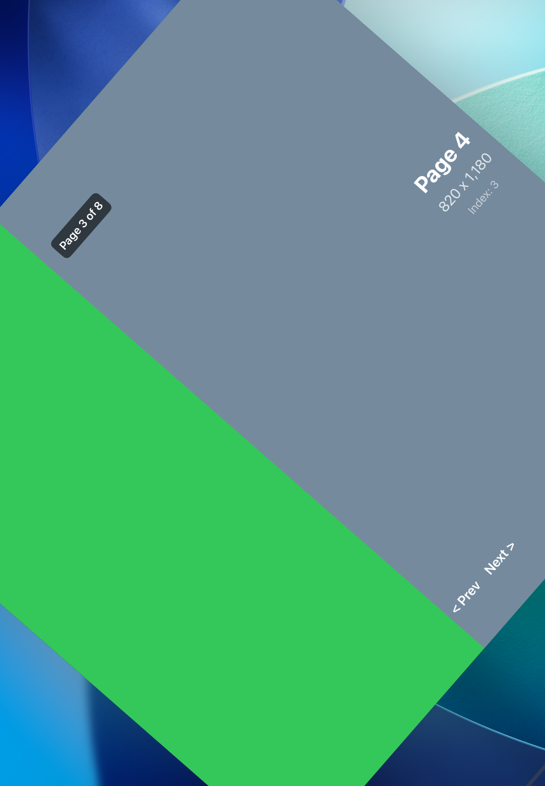
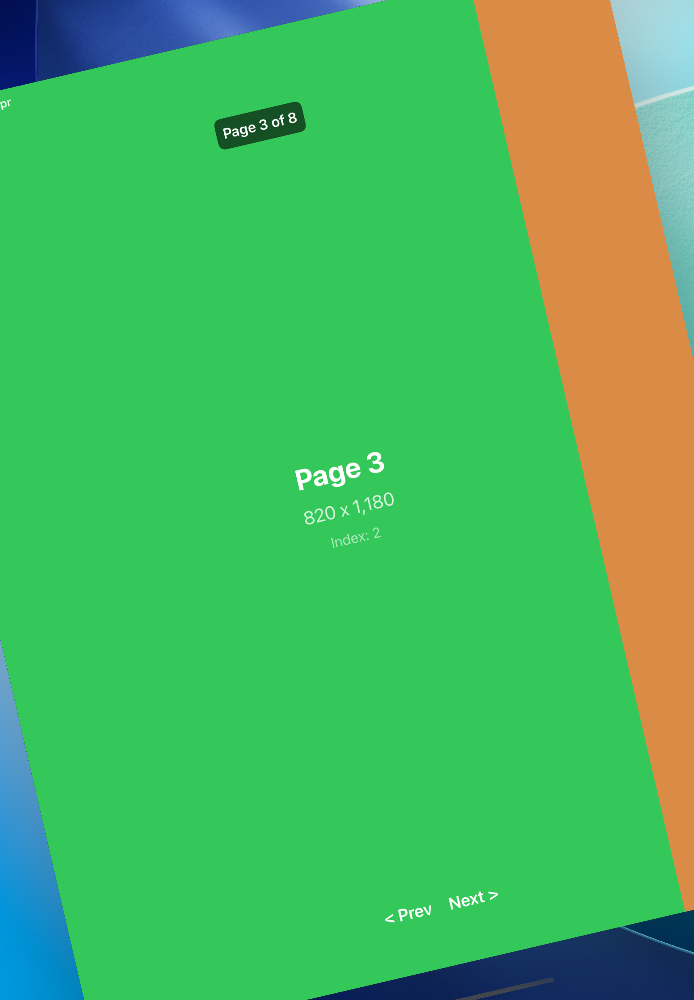

# PagedCollectionView

A full-screen, paged `UICollectionView` wrapped for SwiftUI via `UIViewRepresentable`. It provides smooth horizontal paging with support for dynamic item insertion/deletion, programmatic scrolling, and proper device rotation handling.

## Architecture

The project is composed of three main layers:

### PageCollectionView (SwiftUI layer)

`PageCollectionView` is a generic `UIViewRepresentable` struct that bridges the UIKit collection view into SwiftUI. It accepts:

- A `NSDiffableDataSourceSnapshot` for data
- A `UUID`-based change tracking mechanism (`lastUpdatedUUID`) to trigger snapshot re-application
- Combine subjects for page change events, scroll commands, and drag notifications
- A cell provider closure for cell configuration

It also exposes SwiftUI-style view modifiers:

```swift
PageCollectionView(snapshot: ..., ...)
    .collectionViewBackgroundColor(.black)
    .animateDifferences(true)
    .onUpdate { /* completion */ }
```

### FullScreenPageCollectionView (UIKit layer)

A `UICollectionView` subclass that manages:

- **Paging** via `isPagingEnabled` and a custom `PageFlowLayout`
- **Programmatic scrolling** through a `scrollTo` Combine subject
- **Page tracking** via scroll view delegate methods
- **Rotation handling** with content offset correction and adjacent cell hiding

### PageFlowLayout (Layout engine)

A custom `UICollectionViewFlowLayout` subclass that:

- Calculates full-screen cell frames manually in `prepare()`
- Handles layout invalidation during bounds changes (rotation)
- Adjusts content offset through `invalidationContext(forBoundsChange:)` and `targetContentOffset(forProposedContentOffset:)`
- Corrects offset drift in `finalizeCollectionViewUpdates()`

## Protocols

| Protocol | Purpose |
|----------|---------|
| `PageInfo` | Describes a page (index + direction) |
| `PageChange` | Wraps a `PageInfo` with an `animated` flag |

These protocols allow the paging system to be generic and reusable across different data models.

## Demo: RotationTestView

The included `RotationTestView` provides a test harness with:

- 8 colored full-screen pages
- Prev/Next navigation buttons
- Per-cell action buttons:
  - **Insert +/-1** - Inserts one item before and one after the current page
  - **Delete +/-1** - Removes the last inserted items
  - **Next in 3s** - Programmatically scrolls to the next page after a 3-second delay

## Rotation Issue

During development, two rotation-related issues were identified and fixed in the custom `PageFlowLayout`.

### Issue 1: Content offset miscalculation after rotation

After rotating the device while on a page other than the first, the content offset was not correctly recalculated, resulting in the view showing a split between two pages:

<p align="center">
  
</p>

**Root cause:** During rotation, UIKit's built-in paging (`isPagingEnabled`) could override the custom layout's offset corrections during intermediate animation states.

**Fix:** A `layoutSubviews` override in `FullScreenPageCollectionView` that detects when the content offset has drifted from the expected position and snaps it back:

```swift
public override func layoutSubviews() {
    super.layoutSubviews()
    let expectedOffset = CGFloat(currentPageIndex) * bounds.width
    if bounds.width > 0 && abs(contentOffset.x - expectedOffset) > 1
        && !isDragging && !isDecelerating && !isScrollingToItem {
        contentOffset.x = expectedOffset
    }
}
```

The `!isScrollingToItem` guard prevents the correction from cancelling programmatic `scrollToItem` animations.

### Issue 2: Adjacent cells visible during rotation animation

During the rotation animation, cells adjacent to the current page would briefly appear, creating a visually jarring experience:

<p align="center">
  
  
  
</p>

**Root cause:** UIKit animates cell frames from old positions/sizes to new positions/sizes during rotation. Adjacent cells that were off-screen animate through visible positions during this transition.

**Fix:** Detect bounds size changes in `layoutSubviews`, immediately hide non-current-page cells, and restore them after the rotation animation completes:

```swift
if sizeChanged {
    for cell in visibleCells {
        if let indexPath = indexPath(for: cell), indexPath.item != currentPageIndex {
            cell.isHidden = true
        }
    }
    DispatchQueue.main.asyncAfter(deadline: .now() + 0.4) { [weak self] in
        guard let self else { return }
        for cell in self.visibleCells {
            cell.isHidden = false
        }
    }
}
```

## Requirements

- iOS 17.0+
- Xcode 16+
- Swift 6
